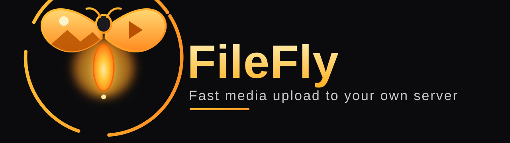

<div align="center">



**Fast bulk photo &amp; video upload to your own self-hosted server — straight from the Android Share Sheet.**

[](https://github.com/Labushuya/filefly/releases)
[](LICENSE)
[-3DDC84?logo=android&logoColor=white)](https://developer.android.com)
[](https://github.com/Labushuya/filefly/actions/workflows/ci.yml)

</div>

---

FileFly is the Android companion app for **[filefly-server](https://github.com/Labushuya/filefly-server)** — a small, self-hosted upload server you run on your own hardware (a Raspberry Pi with a mounted HDD, a NAS, any Linux box on your LAN). Share images and videos from any app — one at a time or in bulk — and FileFly uploads them to your server, chunked and controlled, with a directory picker, permission-aware access, and conflict handling.

Nothing leaves your network. Access is invite-based, scoped to a role and a directory.

> ⚠️ **Distribution:** FileFly is not on Google Play. It is distributed as a signed APK via GitHub Releases (sideload). The built-in updater keeps it current after the first install.

## Features

- **Share Sheet integration** — send photos &amp; videos (single or bulk) from Gallery, Files, or any app directly into FileFly.
- **Chunked uploads** — large files are split into configurable chunks and uploaded reliably, with per-file and overall progress.
- **Directory picker** — browse your server's folders (within your granted base path) and choose where to upload; create folders if your role allows.
- **Conflict handling** — when a file already exists you choose *Overwrite / Rename / Skip*, with an *"apply to all"* option for the rest of the batch.
- **Role-aware** — the UI only offers what your invite permits (see [Roles](#roles)).
- **Upload history** — every upload is recorded with status; review or clear it any time.
- **In-app updater** — checks GitHub Releases, verifies the APK's SHA-256, and installs via the system installer.
- **Material You** — dynamic color on Android 12+, light/dark, with a branded fallback.

## How it works

```
┌─────────────┐   Share (SEND / SEND_MULTIPLE)   ┌──────────────┐   chunked HTTP    ┌────────────────┐
│  Any app    │ ───────────────────────────────▶ │   FileFly    │ ────────────────▶ │ filefly-server │
│ (Gallery…)  │        image/* · video/*         │  (this app)  │  init→chunk→done  │  (your LAN)     │
└─────────────┘                                   └──────────────┘                   └────────────────┘
```

## Installation

1. Go to [**Releases**](https://github.com/Labushuya/filefly/releases) and download the latest `filefly-vX.Y.Z.apk`.
2. Open the APK on your Android device. On first install, Android asks you to allow *"install unknown apps"* for the installing app — grant it.
3. Launch FileFly and complete setup (below).

From then on, the **in-app updater** (Settings → *Check for updates*) handles new versions.

## Setup

You need a running [filefly-server](https://github.com/Labushuya/filefly-server) on your LAN and an **invite code** from its admin.

1. Enter the **server URL**, e.g. `http://192.168.1.50:8000`, and tap *Test connection*.
2. Enter your **invite code** and tap *Redeem invite*.
3. FileFly stores your session (role + base directory) and you're ready to share.

## Roles

Invites are bound to a role, a base directory, and a permission set — enforced by the server and reflected in the app UI:

| Role | Upload | Create/Rename folders | Delete | Scope |
|---|:---:|:---:|:---:|---|
| **Admin** | ✅ | ✅ | ✅ | Full access, invite management |
| **User** | ✅ | ✅ | — | Fixed base directory from the invite |
| **Service** | ✅ | — | — | Automated, fixed directory, no UI actions |
| **Guest** | ✅ | — | — | Temporary (expiring invite), fixed directory |

## Building from source

Requires JDK 21. The Android SDK is resolved automatically in CI; locally, add a `local.properties` with `sdk.dir=/path/to/Android/sdk`.

```bash
./gradlew ktlintCheck detekt   # lint gates
./gradlew testDebugUnitTest test   # unit tests (JVM core is emulator-free)
./gradlew :app:assembleDebug   # debug APK
```

Release builds are produced only by CI (they require the stable signing key held as a GitHub secret). See [`.github/workflows/release.yml`](.github/workflows/release.yml).

## Architecture

Multi-module Gradle build with convention plugins in `build-logic/`:

- `core-common` — pure Kotlin: SemVer, roles, shared types (JVM-testable).
- `core-network` — OkHttp + kotlinx.serialization client, chunked uploader.
- `core-data` — DataStore (settings/session) + Room (upload history).
- `core-ui` — Material 3 theme, shared Composables.
- `feature-onboarding` · `feature-upload` · `feature-history` · `feature-settings` · `feature-updater`
- `app` — the single Application: DI wiring (Hilt), navigation, share-intent handling.

## Contributing

FileFly is open source (MIT) and meant to be usable by anyone for their own home server. See [CONTRIBUTING.md](CONTRIBUTING.md). Commit messages follow [Conventional Commits](https://www.conventionalcommits.org/) (Release Please drives versioning).

## License

[MIT](LICENSE) © 2025 Labushuya
